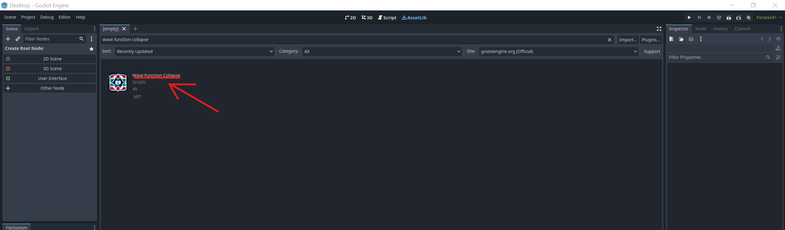

# Carmop-WFC_AnxietyCurves_SuperMarioBros

### Description

An attempt to implement anxiety curves into wave function collapse level generation in order to 
end up with an algorithm that can create pseudo-random levels based on desired difficulty.

- Wave function collapse:
	A generation algorithm which uses pre-set rules or rules inferred from a valid input to 
	generate similar permutations of the input.
	
- Anxiety Curves:
	The qualitative curve that describes a player's challenge in traversing a video game 
	level (in this case a 2D platforming level)

The idea behind combining both concepts is to create a easy to use level generator that accounts 
for intended difficulty

### Set up

This project runs on the GODOT game engine (specifically version 4.0.4).
To download and run the code first install GODOT:
- GODOT Website: https://godotengine.org/
- GODOT version archive (for downloading the 4.0.4 version specifically): https://godotengine.org/download/archive/

The project also uses the "WFC (Wave Function Collapse) and generic constraint-solving implementation for Godot 4" addon which is, as the name suggests, a version of the WFC algorithm for GODOT game engine. It can be installed onto GODOT through the following steps: 
- Open GODOT and click `AssetLib` tab on the top-center of the window:

- Search "wave function collapse" on the search bar:

- Click the addon name:

- Click `Download` and follow the prompts:

### Running

- In order to run right click the `node_2d.tscn` on the `FileSystem` tab and click the first option: `Open Scene`

- Now press the play :arrow_forward: button on the top-right corner of the program window 

**if the program does not immediately run refer bellow:**
	- In another scene opens, right click the `node_2d` tab on the top left of the program window and select the `Play This Scene` option
	- In case the "Please Confirm..." prompt window appears click `Select Current`

### Resources
- GODOT documentation: https://docs.godotengine.org/en/stable/index.html

- WFC GODOT Package: https://github.com/AlexeyBond/godot-constraint-solving

### Acknowledgements

- [Teams working on GODOT project](https://godotengine.org/teams/) for the free, open-source game engine 

- [AlexeyBond](https://github.com/AlexeyBond) for the WFC package

- [RottingPixels](https://rottingpixels.itch.io/) for the tileset art used
